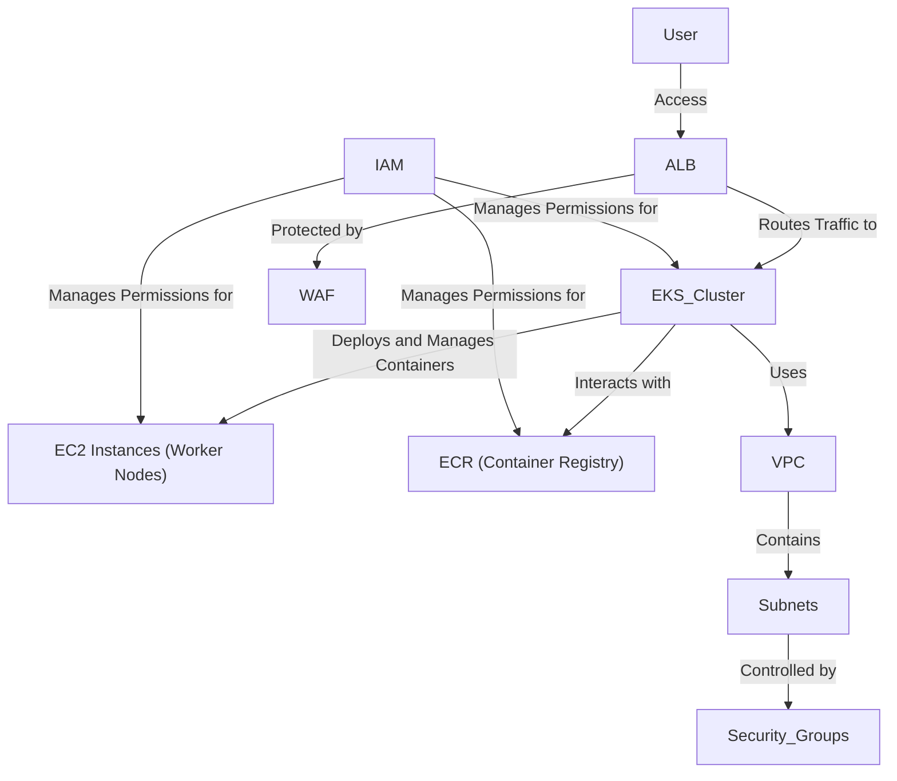

# Terraform AWS Infrastructure

This directory contains Terraform configurations for deploying and managing AWS infrastructure for the Sock Shop application.

## Architecture

The following diagram illustrates the high-level architecture of the infrastructure provisioned by these Terraform configurations:



## Directory and File Structure

The Terraform configurations are organized into a modular structure to promote reusability and maintainability.

```
.
├── main.tf
├── variables.tf
├── outputs.tf
├── providers.tf
├── terraform.tfvars.example
└── modules/
    ├── vpc/
    │   ├── main.tf
    │   ├── variables.tf
    │   └── outputs.tf
    ├── security_groups/
    │   ├── main.tf
    │   ├── variables.tf
    │   └── outputs.tf
    ├── iam/
    │   ├── main.tf
    │   ├── variables.tf
    │   └── outputs.tf
    ├── ec2/
    │   ├── main.tf
    │   ├── variables.tf
    │   └── outputs.tf
    ├── ecr/
    │   ├── main.tf
    │   ├── variables.tf
    │   └── outputs.tf
    ├── eks/
    │   ├── main.tf
    │   ├── variables.tf
    │   └── outputs.tf
    ├── alb/
    │   ├── main.tf
    │   ├── variables.tf
    │   └── outputs.tf
    └── waf/
        ├── main.tf
        ├── variables.tf
        └── outputs.tf
```

### Root Level Files

*   `main.tf`: The main entry point for the Terraform configuration, orchestrating the modules.
*   `variables.tf`: Defines all input variables used across the root module and passed to child modules.
*   `outputs.tf`: Defines output values that can be referenced by other Terraform configurations or used for external consumption.
*   `providers.tf`: Configures the AWS provider and any other necessary providers.
*   `terraform.tfvars.example`: An example file for defining variable values, to be copied and customized as `terraform.tfvars`.

### Modules Directory

The `modules/` directory contains reusable Terraform modules for specific AWS resources or functionalities. Each module typically includes:

*   `main.tf`: Defines the resources created by the module.
*   `variables.tf`: Defines the input variables specific to the module.
*   `outputs.tf`: Defines the output values exported by the module.

#### Module Breakdown:

*   **`vpc/`**: Manages the Virtual Private Cloud (VPC) network, including subnets, route tables, and internet gateways.
*   **`security_groups/`**: Configures security groups to control inbound and outbound traffic for various resources.
*   **`iam/`**: Manages Identity and Access Management (IAM) roles, policies, and users.
*   **`ec2/`**: Provisions and manages EC2 instances, including Auto Scaling Groups and Launch Configurations.
*   **`ecr/`**: Manages Amazon Elastic Container Registry (ECR) repositories for Docker images.
*   **`eks/`**: Deploys and manages Amazon Elastic Kubernetes Service (EKS) clusters.
*   **`alb/`**: Configures Application Load Balancers (ALB) for distributing incoming application traffic.
*   **`waf/`**: Integrates AWS Web Application Firewall (WAF) for protecting web applications from common web exploits.

## Usage

Follow these steps to deploy the AWS infrastructure using Terraform:

1.  **Initialize Terraform**:
    Navigate to the `aws/terraform` directory and initialize the Terraform working directory. This command downloads the necessary provider plugins.
    ```bash
    terraform init
    ```

2.  **Plan the Deployment**:
    Generate an execution plan to see what actions Terraform will perform. This step is optional but highly recommended to review changes before applying.
    ```bash
    terraform plan -var-file="<ENVIRONMENT>.tfvars"
    ```
    Replace `<ENVIRONMENT>` with `dev`, `qa`, `staging`, or `prod` as needed (e.g., `terraform plan -var-file="dev.tfvars"`).

3.  **Apply the Deployment**:
    Apply the changes required to reach the desired state of the configuration.
    ```bash
    terraform apply -var-file="<ENVIRONMENT>.tfvars"
    ```
    Replace `<ENVIRONMENT>` with `dev`, `qa`, `staging`, or `prod` as needed. Confirm the action by typing `yes` when prompted.

4.  **Destroy the Infrastructure (Optional)**:
    To remove all resources managed by this Terraform configuration, run the destroy command. Use with caution!
    ```bash
    terraform destroy -var-file="<ENVIRONMENT>.tfvars"
    ```
    Replace `<ENVIRONMENT>` with `dev`, `qa`, `staging`, or `prod` as needed. Confirm the action by typing `yes` when prompted. 